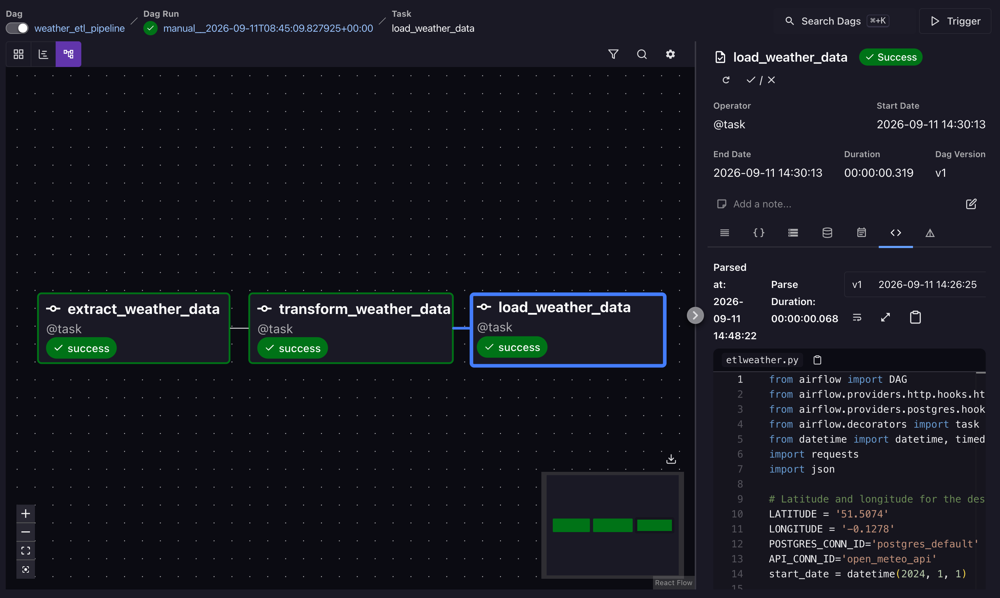
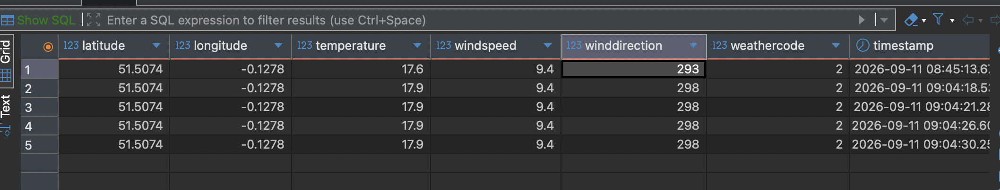
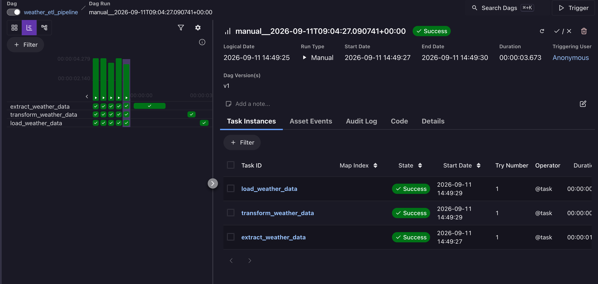

# Weather ETL Pipeline
 
A simple daily ETL pipeline built with **Apache Airflow** (via **Astro CLI**) that extracts live weather data from the Open-Meteo API, transforms it, and loads it into a PostgreSQL database.
 
**Flow:** Open-Meteo API → Extract → Transform → Load → PostgreSQL
 
---
 
## What it does
 
Every day, the pipeline:
1. **Extracts** the current weather for a fixed location (London, by default) from the [Open-Meteo](https://open-meteo.com/) API
2. **Transforms** the raw JSON response into a flat, structured record
3. **Loads** that record into a `weather_data` table in PostgreSQL, creating the table automatically if it doesn't exist
Built using Airflow's **TaskFlow API** (`@task` decorators), so data passes between tasks as native Python return values (via XCom) rather than manual pushes/pulls.
 
---
 
## Architecture
 
```
Open-Meteo API  →  extract_weather_data  →  transform_weather_data  →  load_weather_data  →  PostgreSQL
                        (HttpHook)              (Python)                  (PostgresHook)
```
 
## Tech stack
 
Python · Apache Airflow 3 (Astro Runtime) · Astro CLI · PostgreSQL · `apache-airflow-providers-http` · `apache-airflow-providers-postgres`
 
---
 
## Project structure
 
```
├── dags/
│   └── etlweather.py       # the DAG: extract → transform → load
├── requirements.txt         # Airflow providers (http, postgres)
├── airflow_settings.yaml    # local connections (open_meteo_api, postgres_default)
├── Dockerfile                # Astro runtime base image
└── README.md
```
 
---
 
## How it works
 
### 1 · Extract — `extract_weather_data`
Uses `HttpHook` with the `open_meteo_api` Airflow connection to call:
```
GET /v1/forecast?latitude={LAT}&longitude={LON}&current_weather=true
```
Returns the raw JSON weather response.
 
### 2 · Transform — `transform_weather_data`
Flattens the `current_weather` object from the API response into a clean dict: `latitude`, `longitude`, `temperature`, `windspeed`, `winddirection`, `weathercode`.
 
### 3 · Load — `load_weather_data`
Uses `PostgresHook` with the `postgres_default` connection to:
- Create the `weather_data` table if it doesn't already exist
- Insert the transformed record, with a `timestamp` defaulting to the current time
### Schedule
Runs `@daily`, with `catchup=False` so it only runs going forward from the current date, not backfilled for every day since `start_date`.
 
---
 
## Setup
 
### 1 · Install dependencies
`requirements.txt`:
```
apache-airflow-providers-http
apache-airflow-providers-postgres
```
 
### 2 · Set up Airflow connections
Two connections are required — either via the Airflow UI (**Admin → Connections**) or `airflow_settings.yaml`:
 
**`open_meteo_api`** (HTTP)
| Field | Value |
|---|---|
| Connection Type | HTTP |
| Host | `https://api.open-meteo.com` |
 
**`postgres_default`** (Postgres)
| Field | Value |
|---|---|
| Connection Type | Postgres |
| Host | wherever your Postgres instance is reachable from the Airflow containers |
| Port | `5432` |
| Login / Password / Schema | your Postgres credentials |
 
Example `airflow_settings.yaml`:
```yaml
airflow:
  connections:
    - conn_id: open_meteo_api
      conn_type: http
      conn_host: https://api.open-meteo.com
    - conn_id: postgres_default
      conn_type: postgres
      conn_host: postgres
      conn_schema: postgres
      conn_login: postgres
      conn_password: postgres
      conn_port: 5432
```
 
### 3 · Run locally with Astro CLI
```bash
astro dev start
```
Open `http://localhost:8080`, un-pause `weather_etl_pipeline`, and trigger it.
 
> Changes to `dags/etlweather.py` are picked up automatically (no restart needed). Changes to `requirements.txt`, `Dockerfile`, or `airflow_settings.yaml` require `astro dev restart`.
 
---
 
## Configuration
 
Change the target location by editing the constants at the top of `etlweather.py`:
```python
LATITUDE = '51.5074'
LONGITUDE = '-0.1278'
```
 
---
 
## Possible next steps
- Parameterize location via Airflow Variables instead of hardcoded constants, to support multiple cities
- Add data quality checks (e.g. reject rows with null temperature)
- Add a dbt layer on top of `weather_data` for historical trend marts
- Add alerting (Slack/email) on task failure
 
** Photo One (DAG) **


** Photo Two (DBEAVER) ** 


** Photo Three (DAG) ** 
